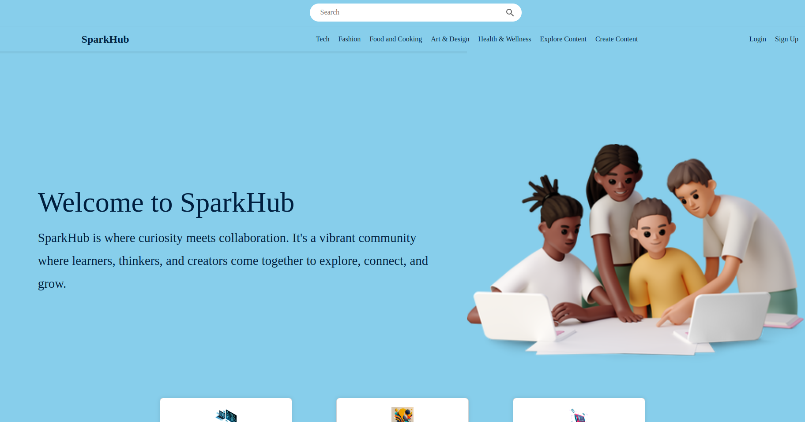

# SPARKHUB PLATFORM

<p> Welcome to SparkHub, a dynamic knowledge sharing hub powered by Django and React! SparkHub is not just another educational platform; it's a versatile space for users to share and collaborate on various types of content, whether it's educational materials, creative projects, or industry insights. </p>

## Features
- User Management: User registration, login, and logout functionalities with authentication and authorization mechanisms.

- Content Management: Model creation for different content types (text, images, videos), with functionalities to create, edit, and delete content, along with user permissions management.

- Search Functionality: Full-text search for content based on title, tags, and content itself.


## Technologies Used

- Backend:Django
- Frontend: React
- Database: PostgreSQL

## Getting Started

1. Clone the repository:
```sh
git clone https://github.com/catherinekimani/SparkHub-Frontend

git clone https://github.com/catherinekimani/SparkHub-Backend
```
```sh
cd SparkHub-Backend/
# Setup and activate virtual environment
python3 -m venv virtual

source virtual/bin/activate

# Install dependencies
pip install -r requirements.txt

# Run migrations
python manage.py migrate

# Start Django development server
python manage.py runserver
```

### Setup Frontend:

```sh
cd SparkHub-Frontend/

# Install dependencies
npm install

# Start React development server
npm start
```

## Visit http://localhost:3000

## Contact
If you have any questions, suggestions, or just want to say hello, you can reach out to me at:

Email: sparkhubinfo2024@gmail.com
Twitter: [ckimani](https://twitter.com/ckimani882)
LinkedIn: [CatherineKimani](https://www.linkedin.com/in/catherine-kimani/)